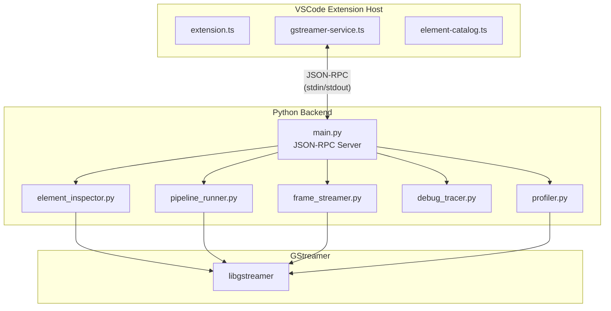

# GStreamer Pipeline Studio

A comprehensive Visual Studio Code extension for building, testing, and debugging GStreamer pipelines with a visual drag-and-drop interface.

## Features

- **Visual Pipeline Builder**: Drag-and-drop interface using React Flow for creating GStreamer pipelines
- **Element Palette**: Searchable catalog of all available GStreamer elements organized by category
- **Property Editor**: Configure element properties with type-aware input controls
- **Embedded Media Preview**: Watch video output directly within VSCode via JPEG frame streaming
- **Pipeline Validation**: Real-time validation with error highlighting and VSCode diagnostics integration
- **Debug Log Panel**: View and filter GST_DEBUG output with color-coded severity levels, including pipeline errors
- **Performance Profiling**: Monitor FPS, latency, buffer counts, and memory usage
- **Buffer Flow Visualization**: See buffer counts on edges during playback with animated data flow
- **Export Options**: Convert visual pipelines to gst-launch commands, Python code, or C code
- **Undo/Redo**: Full undo/redo support for all pipeline modifications
- **Keyboard Shortcuts**: Quick access to common operations

## Requirements

### System Requirements

- **Linux** (primary supported platform)
- **GStreamer 1.20+** with development libraries
- **Python 3.8+** with GStreamer bindings
- **Node.js 18+** and npm

### GStreamer Dependencies

Install GStreamer and Python bindings on Ubuntu/Debian:

```bash
sudo apt install \
    gstreamer1.0-tools \
    gstreamer1.0-plugins-base \
    gstreamer1.0-plugins-good \
    gstreamer1.0-plugins-bad \
    gstreamer1.0-plugins-ugly \
    python3-gi \
    python3-gst-1.0 \
    gir1.2-gst-plugins-base-1.0
```

On Fedora/RHEL:

```bash
sudo dnf install \
    gstreamer1-tools \
    gstreamer1-plugins-base \
    gstreamer1-plugins-good \
    gstreamer1-plugins-bad-free \
    python3-gobject \
    python3-gstreamer1
```

On Arch Linux:

```bash
sudo pacman -S \
    gstreamer \
    gst-plugins-base \
    gst-plugins-good \
    gst-plugins-bad \
    python-gobject
```

## Installation

### From Source

1. Clone the repository:
   ```bash
   cd /path/to/gstreamer-pipeline-studio
   ```

2. Install dependencies:
   ```bash
   npm install
   ```

3. Build the extension:
   ```bash
   npm run build
   ```

4. Launch VSCode with the extension:
   ```bash
   code --extensionDevelopmentPath=.
   ```

### From VSIX (Coming Soon)

```bash
code --install-extension gstreamer-pipeline-studio-0.1.0.vsix
```

## Usage

### Creating a New Pipeline

1. Open the Command Palette (`Ctrl+Shift+P`)
2. Run "GStreamer: Open Pipeline Editor"
3. A new `.gstpipe` file will open with the visual editor

### Building a Pipeline

1. **Add Elements**: Drag elements from the palette on the left to the canvas
2. **Connect Elements**: Click and drag from a source pad (right side) to a sink pad (left side)
3. **Configure Properties**: Click an element to view and edit its properties in the right panel

### Running a Pipeline

1. Click the **Run** button in the toolbar or press `Ctrl+Enter`
2. View the output in the **Preview** tab at the bottom
3. Monitor debug messages and errors in the **Debug Log** tab
4. Check performance metrics in the **Metrics** tab
5. Use **Pause** to temporarily stop playback
6. Click **Stop** or press `Ctrl+.` to halt the pipeline

### Exporting Pipelines

Click the **Export** dropdown in the toolbar to export in multiple formats:

- **gst-launch command**: Shell script with `gst-launch-1.0` command
- **Python code**: Complete Python script using GStreamer bindings
- **C code**: Full C program with GStreamer API calls

### Keyboard Shortcuts

| Shortcut | Action |
|----------|--------|
| `Ctrl+Z` | Undo |
| `Ctrl+Y` / `Ctrl+Shift+Z` | Redo |
| `Ctrl+Enter` | Run pipeline |
| `Ctrl+.` | Stop pipeline |
| `Ctrl+Shift+V` | Validate pipeline |
| `Delete` / `Backspace` | Delete selected element |

## File Format

Pipeline files use the `.gstpipe` extension and contain JSON:

```json
{
  "version": "1.0",
  "name": "My Pipeline",
  "nodes": [
    {
      "id": "node-1",
      "type": "videotestsrc",
      "position": { "x": 100, "y": 200 },
      "properties": { "pattern": "ball" }
    },
    {
      "id": "node-2",
      "type": "autovideosink",
      "position": { "x": 400, "y": 200 },
      "properties": {}
    }
  ],
  "edges": [
    {
      "id": "edge-1",
      "source": "node-1",
      "sourceHandle": "src",
      "target": "node-2",
      "targetHandle": "sink"
    }
  ]
}
```

## Configuration

Configure the extension in VSCode settings:

| Setting | Default | Description |
|---------|---------|-------------|
| `gstreamer.pythonPath` | `python3` | Path to Python interpreter with GStreamer bindings |
| `gstreamer.debugLevel` | `2` | GST_DEBUG level (0=none, 5=verbose) |
| `gstreamer.frameRate` | `30` | Maximum frame rate for video preview |
| `gstreamer.jpegQuality` | `80` | JPEG quality for preview frames (10-100) |

## Architecture



## Development

### Project Structure

```
gstreamer-pipeline-studio/
├── src/
│   ├── extension/          # VSCode extension host (TypeScript)
│   │   ├── extension.ts    # Entry point
│   │   ├── gstreamer-service.ts
│   │   ├── element-catalog.ts
│   │   ├── pipeline-document.ts
│   │   └── diagnostics.ts
│   ├── webview/            # React application
│   │   ├── App.tsx
│   │   ├── components/     # React components
│   │   ├── hooks/          # Custom React hooks
│   │   ├── types/          # TypeScript types
│   │   └── utils/          # Utility functions
│   ├── backend/            # Python GStreamer service
│   │   ├── main.py
│   │   ├── element_inspector.py
│   │   ├── pipeline_runner.py
│   │   ├── frame_streamer.py
│   │   ├── debug_tracer.py
│   │   └── profiler.py
│   └── data/               # Static data
│       └── element-catalog.json
├── package.json
├── tsconfig.json
├── webpack.extension.config.js
└── webpack.webview.config.js
```

### Building

```bash
# Development build with watch
npm run watch

# Production build
npm run build

# Lint code
npm run lint
```

### Testing

```bash
npm test
```

## Troubleshooting

### "GStreamer backend not running"

Ensure Python 3 with GStreamer bindings is installed:

```bash
python3 -c "import gi; gi.require_version('Gst', '1.0'); from gi.repository import Gst; print('OK')"
```

### "Element not found"

Install additional GStreamer plugins:

```bash
sudo apt install gstreamer1.0-plugins-bad gstreamer1.0-plugins-ugly
```

### Video preview not showing

1. Check that `jpegenc` element is available: `gst-inspect-1.0 jpegenc`
2. Try reducing frame rate in settings
3. Check the Debug Log tab for errors

## Contributing

1. Fork the repository
2. Create a feature branch
3. Make your changes
4. Run tests and linting
5. Submit a pull request

## License

MIT License - see LICENSE file for details.

## Acknowledgments

- [GStreamer](https://gstreamer.freedesktop.org/) - Multimedia framework
- [React Flow](https://reactflow.dev/) - Graph visualization library
- [VSCode Extension API](https://code.visualstudio.com/api) - Extension development


